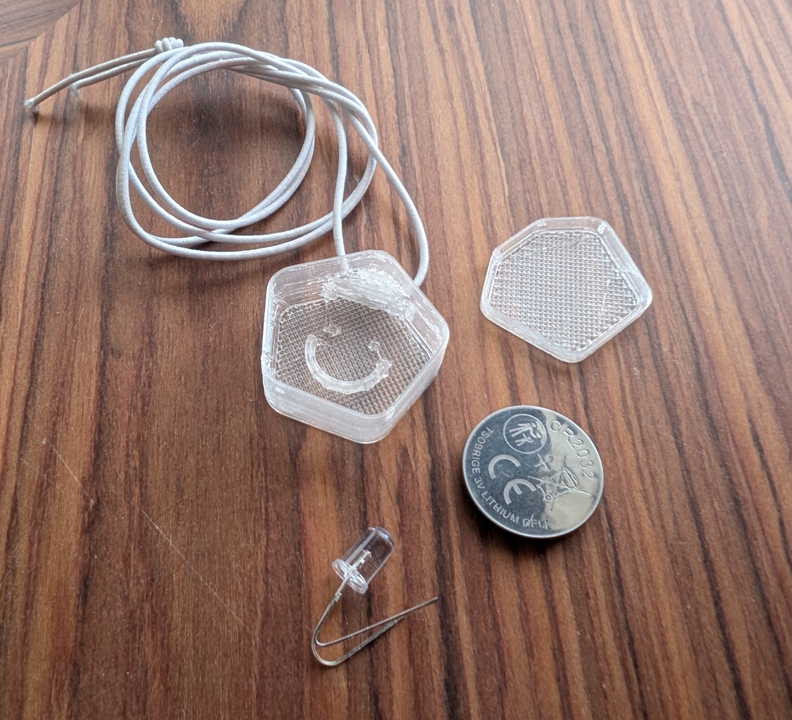

# Design Workshop D1- Assembly LED Charm

Workshop to easily assemble a wearable blinking LED charm. Several variations exist and this is mainly based on [MakerTjej Ljushängen](http://www.makertjej.se/ljushangen)

## Workshop outline

Being able to assemble a wearable LED charm is an easy and fun way to get someone curious on technology.

Requires a 3D-printed casing (or similar), a C32032 battery, a RGB LED diode and some tape.

## Equipment

LED RGB 5mm ~3.4V - Fast or slow blinking https://www.electrokit.com/led-rgb-5mm-diffus-blinkande-snabb

Battery CR2034 3V - https://www.electrokit.com/cr2032-batteri-litium-3v-varta-20-pack-industri-forpackning

3D-printed casing with lid (see design & manufacturing files under the [manufacturing_files_3D-printer](manufacturing_files_3D-printer/readme.md) folder)

String to fasten the charm

Tape

## Preparations

- 3D-print the casing and test that lid and casing fit [https://youtu.be/d-k9be3gT9I](See 3D-printer in action)

- Purchase LED RGB:s, batteries, strings and tape

- Print / write down instructions for the participants

## Instructions

1. Test the LED on the battery (long leg on +) and see how it blinks

2. Bend the LED legs so that the LED stays centered on the battery and still have contact with both + and -

3. Fixate legs with some tape and ensure contact (LED should still be blinking)

4. Add the taped LED + battery into the 3D printed casing with LED facing downwards

5. Close the lid

6. Measure out the string to fit around your head and tie it to a neckless with the blinking casing

