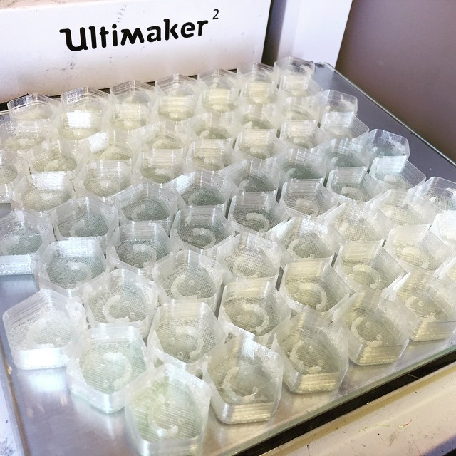
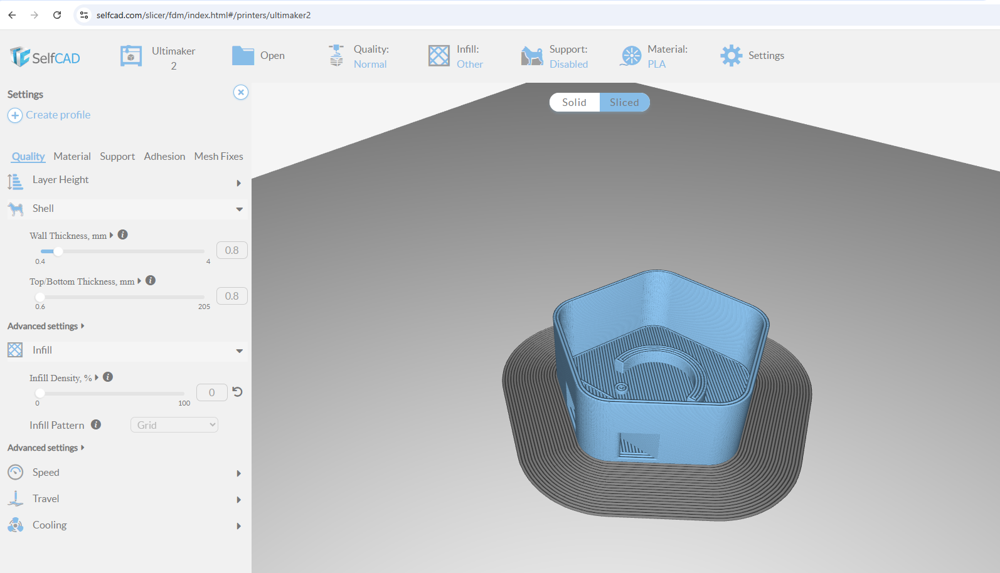

## Makertjej LED Charm v2

This is a redrawn and updated version of the LED Charm posted by jcnbee: https://www.youmagine.com/designs/led-charm .

It has been used on events with the network "Makertjej" (translated "Maker Girls"), Tutorial (in swedish) at: http://www.makertjej.se/ljushangen

It has been optimized to print on the Ultimaker 2 (UM2) with the Olsson Block and a 0.8mm RSB nozzle and a single wall, it requires very custom Cura settings since we more or less are tricking the cura engine in multiple ways to perform a faster print :-)Right now (2015-10-18) the latest version of the "body" part is V11, and the latest version of the "top" part is V9

### Cura Slicer settings

These are the settings for making the "solid" models work as open contours.

Nozzle size: 0.8
Infill Density: 0%
Top Layers: 0%

### License & Credits

License: CC BY-SA 4.0

[Available on Youmagine](https://youmagine.com/designs/makertjej-led-charm-v2)

[@erikcederb](https://www.erikcederberg.se/)