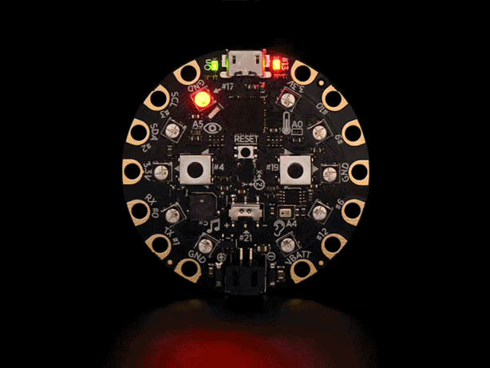

# Design Workshop

Start small by controlling the light in a 1D array (pixel ring)

The adafruit Circuit Playground (classic or express) comes with built in RGB LEDs and a block programming interface to code it. A very easy step when introducing someone to electronics and programming.

