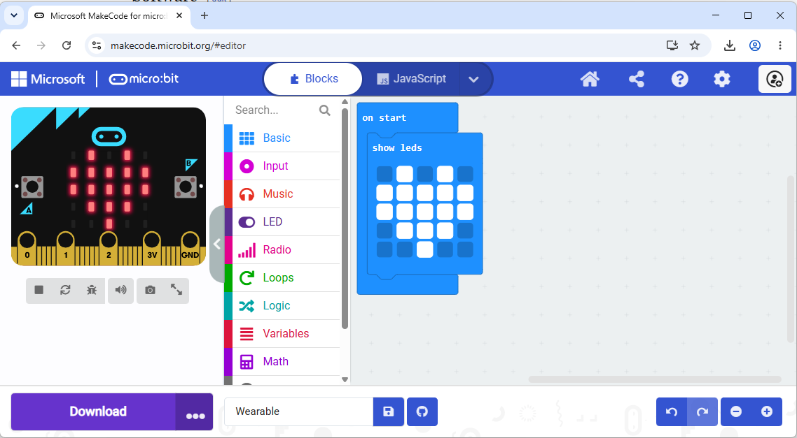

# Design Workshop

Start simple by controlling the light behaviour.

Thanks to the no-code and no-install approach the [micro:bit V2](https://en.wikipedia.org/wiki/Micro_Bit) is a good first starting board to learn some programming while building a wearable. It does not come with RGB diods, but have a 5x5 red diode setup that is controllable.

The micro:bit is an easy to use open source hardware system designed by BBC for eductation.

## Easy start with block programming ## 
The micro:bit is controlled with an online block editor from microsoft called [makecode](https://makecode.microbit.org/). No installation is needed, just download direct from the browser to the micro:bit unit

It also comes with a simulator which helps with instant feedback and can be helpful if there are a limited number of actual boards to use.

## Equipment

- micro:bit v3

- 3V battery (2x 1.5V AAA)

- usb-c cable supporting data transfer (not just charging)

## Example

