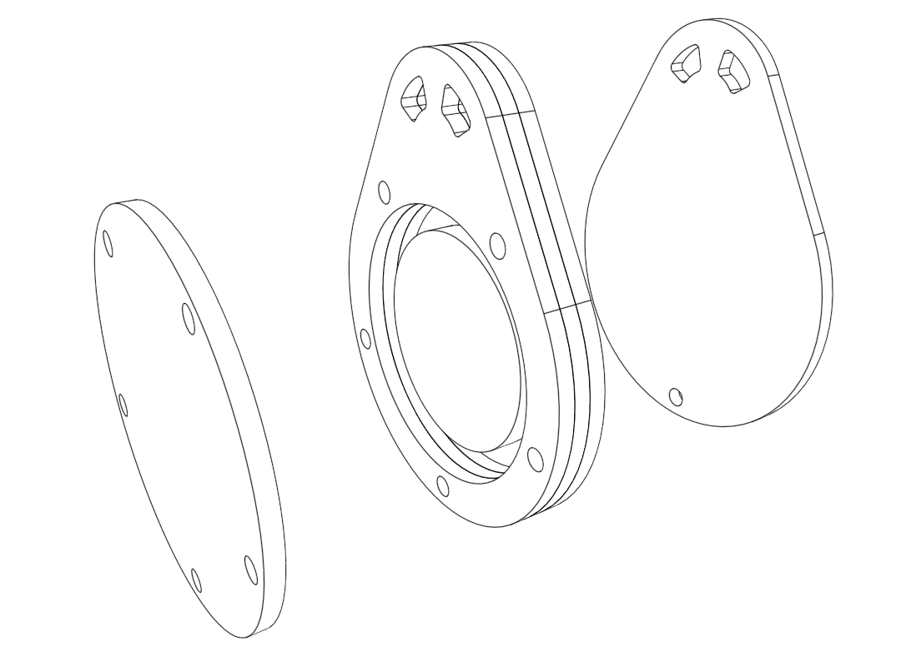

# Design Workshop P2.0 - Design your own casing

## Workshop outline

Now you have tested assembling a LED charm you can design a similar casing yourself.

Keep the same CR2032 battery and RGB LED diode to keep things simple

## Equipment

Free CAD software
- [Onshape](https://www.onshape.com/)
- [Freecad](https://www.freecad.org/) 
- [Shapr3D](https://www.shapr3d.com/)

- Ruler / Caliper to measure

- CR2032 Battery and RGB LED diode to take measurements (and test to assembly)

- Laser Cutter for testing the design (direct or later)

- Plywood sheets 1.5 mm that can be cut easily by a laser

- Plastic sheet 1.5 mm (plexiglas) that can be easily cut by a laser (or manually)

## Preparations

- Install CAD sofware or create online account

## Instructions

Example design

