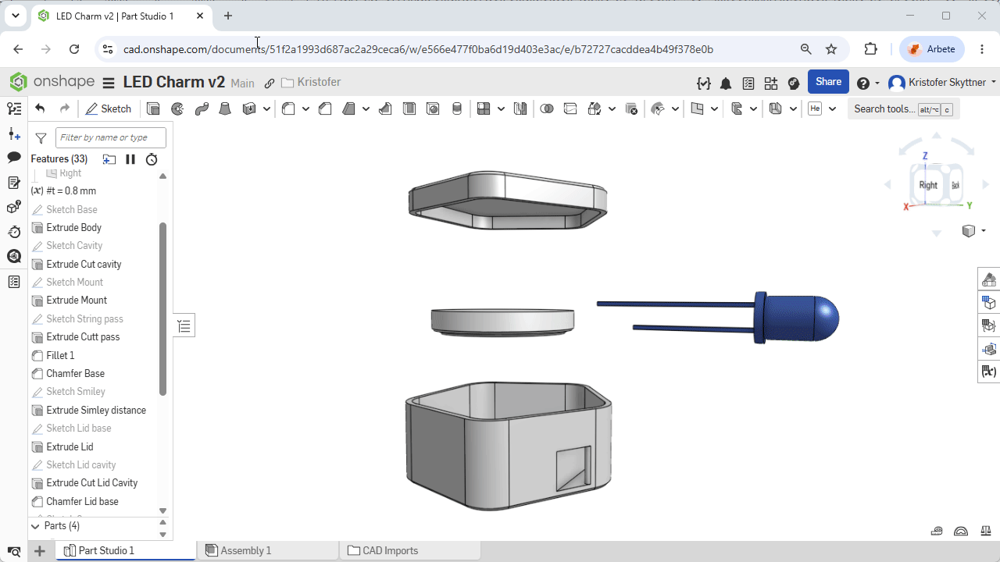

# Design Workshop P2.0 - Design your own casing

## Workshop outline

Now you have tested assembling a LED charm you can design a similar casing yourself.

Keep the same CR2032 battery and RGB LED diode to keep things simple

## Equipment

Free CAD software
- [Onshape](https://www.onshape.com/)
- [Freecad](https://www.freecad.org/) 
- [Shapr3D](https://www.shapr3d.com/)

- Ruler / Caliper to measure

- CR2032 Battery and RGB LED diode to take measurements (and test to assembly)

- 3D printer for testing the design (direct or later)

- 3D printer fillament colorless and transparent

## Preparations

- Install CAD sofware or create online account

## Instructions

1. Import [LED-charm-base_N0.8_v11.step](LED-charm-base_N0.8_v11.step) and [LED-charm-top_N0.8_v11.step](LED-charm-top_N0.8_v11.step) to a CAD software to explore the design and potentially modify to your liking

2. Try designing from scratch with a different shape than the pentagon

3. Export step / stl files

4. Slice and print on 3D-printer

5. Assemble with a CR2032 and RGT LED Diode (see [workshop D1](../D1_Assemble_LED_charm/readme.md))

