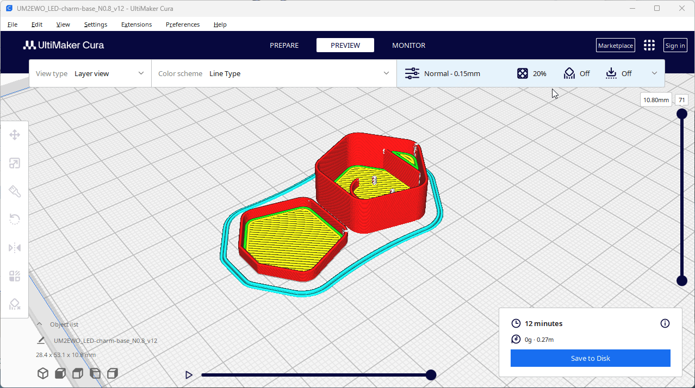

# Design Workshop P2.0 - Design your own casing

## Workshop outline

Now you have tested assembling a LED charm you can design a similar casing yourself.

Keep the same CR2032 battery and RGB LED diode to keep things simple

## Equipment

- A free CAD software like [Onshape](https://www.onshape.com/), [Freecad](https://www.freecad.org/), [Shapr3D](https://www.shapr3d.com/)

- Ruler / Caliper to measure

- CR2032 Battery and RGB LED diode to take measurements (and test to assembly)

- 3D printer for testing the design (direct or later)

- 3D printer fillament colorless and transparent

## Preparations

- Install CAD sofware or create online account

## Instructions

1. Import [LED-charm-base_N0.8_v12.step](LED-charm-base_N0.8_v12.step) and [LED-charm-top_N0.8_v12.step](LED-charm-top_N0.8_v12.step) to a CAD software to explore the design and potentially modify to your liking

2. Try designing from scratch as a pentagon, or a different shape of your liking.

3. Export 3D stl files that the 3D printer Slicer software can import

4. Slice the 3D files and print on 3D-printer (Use [Cura](https://ultimaker.com/software/ultimaker-cura/) or similar)

5. Assemble with a CR2032 and RGB LED Diode (see [workshop A1](../A1_Assemble_LED_charm/readme.md))

