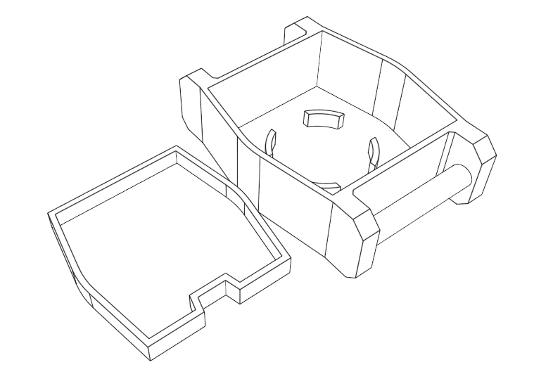
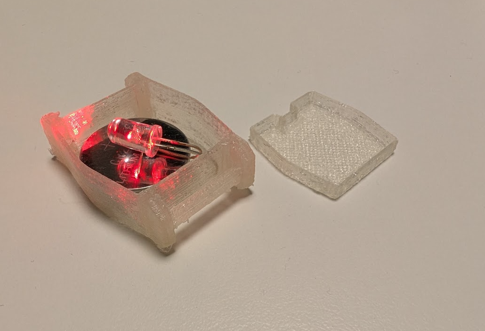

# Design Workshop P4.0 - Design 3D-printed fastener

Designing a fastener for a wearable depends how you want to carry it
- Necklace needs just a string and a hole (easiest)
- Shooes needs a strap or string that can be tied
- Wrist needs a band that can be opened / closed (or temporary enlarged)
- Cloothing needs a clip

## Workshop Outline

Design a casing (or modify previous casing) to fit on the users wrist. Easiest is to add fasteners to the side for 15mm Velcro band (or similar) that can easily be taken on / off by the user.

## Equipment

LED RGB 5mm ~3.4V - Fast or slow blinking

Battery CR2032 3V (20mm x 3.2mm)

15mm wide Velcro band

3D-printer & transparent PLA material

## Instructions

1. Open your favorite CAD software and design (or reuse) a casing that fits a CR2032 battery

2. Add side flanges to the casing so that a band can be tied through

3. Slice and 3D-print it to see how it fits

