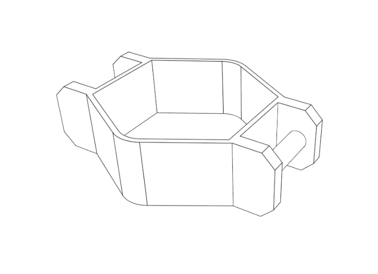

# Design Workshop

Designing a fastener for a wearable depends how you want to carry it
- Necklace needs just a string and a hole (easiest)
- Shooes needs a strap or string that can be tied
- Wrist needs a band that can be opened / closed (or temporary enlarged)
- Cloothing needs a clip

Concept 1 - Modify casing with a clip and mount to clothes 

Concept 2 - Modify casing with side fasteners and mount to wrist with a Velcro or leather strap

Example with 10mm band mounts
