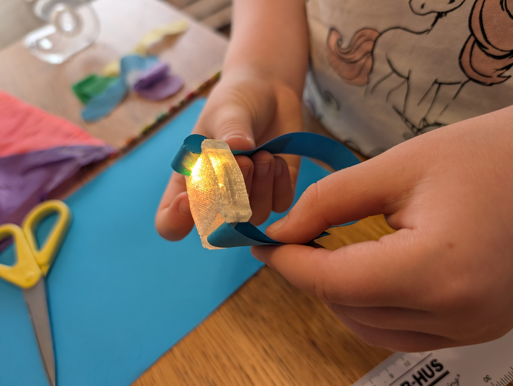
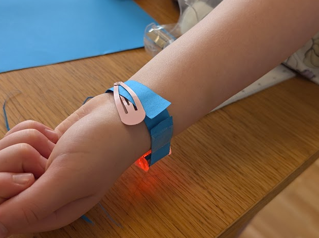

# Design Workshop P4.0 - Design 3D-printed fastener

Designing a fastener for a wearable depends how you want to carry it
- Necklace needs just a string and a hole (easiest)
- Shooes needs a strap or string that can be tied
- Wrist needs a band that can be opened / closed (or temporary enlarged)
- Cloothing needs a clip

In this workshop we will focus on the wrist band and how that can be achieved.

**Design Questions to answer during workshop:**

(II) How should the user wear the product?

(III) How should the user take the product on / off

## Workshop Outline

Design a casing (or modify previous casing) to fit on the users wrist. Easiest is to add fasteners to the side for 15mm Velcro band (or similar) that can easily be taken on / off by the user.

## Equipment

LED RGB 5mm ~3.4V - Fast or slow blinking

Battery CR2032 3V (20mm x 3.2mm)

15mm band for wrist (paper band + hair clip, or real velcro)

3D-printer & transparent PLA material

## Instructions

1. Open your favorite CAD software and design (or reuse) a casing that fits a CR2032 battery. Example design available as step files: [body](wrist-band-LED-charm-body-v1.step) and [lid](wrist-band-LED-charm-lid-v1.step)

2. Add side flanges to the casing so that a band can be tied through

3. Slice and 3D-print the casing and test to assemble a diode and a battery

4. Build a wrist band from paper or velcro and test assemble to wrist

