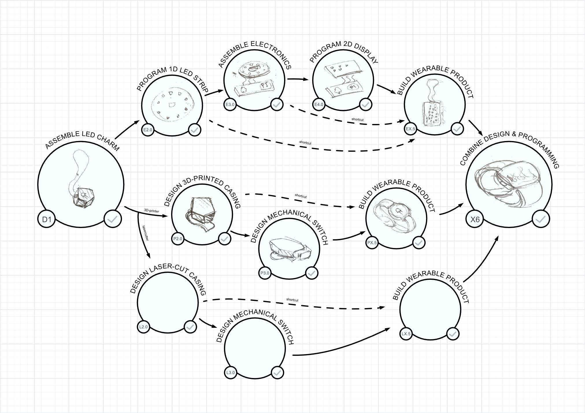
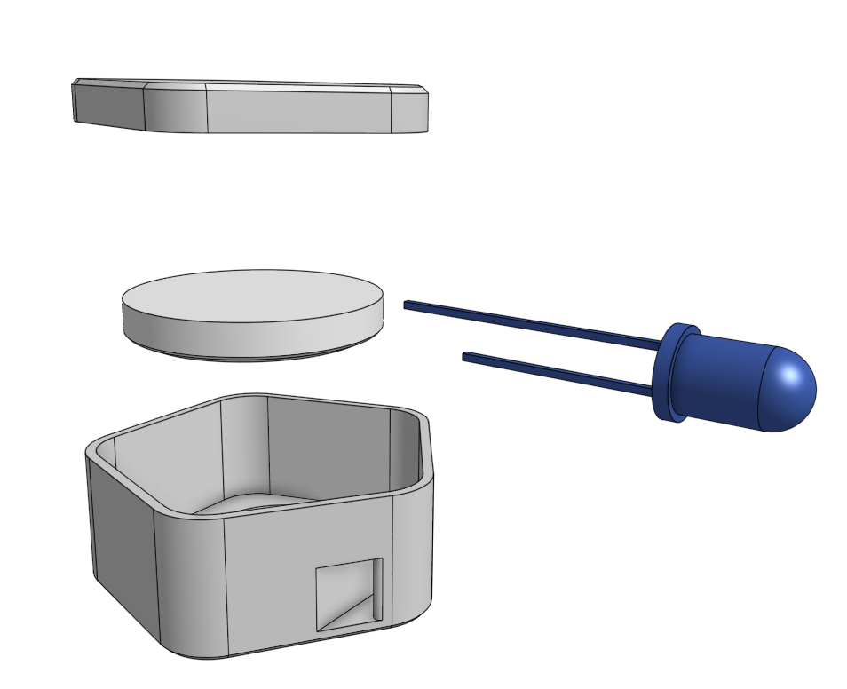

# Design Workshops - How to design wearable products and be introduced to the area of Science, Technology, Engineering and Math (STEM + A = STEAM)

After having the pleasure to participate in the [Swedish maker movement](https://makersofsweden.se) for more than a decade I believe that building a wearable product holds the key to get young persons interested in both product design and technology.

My experience is that many get discorages due to starting with way too hard projects. Therefore I have tried to separate the key dimensions of a wearable product (light source, electronics, casing, fastener, diffusor) and create step by step workshops to master them all.

It's a work in progress so feel free to contribute to the workshops or add variants.

// Kristofer Skyttner

## Workshop outline

There are two ways to start (left side) the journey towards mastering product design of a Wearable. Then combine the knowledge to design full products (right side)

- **D: Casing & fastener design** - Keep the basic blinking LED and focus on x§the casing design and how to mount it to a person (string, clip, wristband, etc). Choose 3D printed or laser cut depending on what equipment you have at hand.

- **E: Programming & electronics** - Skip the casing & use the simplest fastener (string) so you can focus on how to control the behaviour of the light and the electronics

### Where to start (left side of overview) - Play with the wearable technology

Start with the D1 workshop and assemble something ready made to get hands on experience of what we are building and be ready for the first steps

### What you can do when mastering design (right side of overview)

If you master the different workshops you will be better prepared to use all your knowledge to build your own product. This is hard so you need to practice the different aspects of product design before you attempt it.

-for-wearable-product.jpg)

### Workshops

| Path | Play | Productify |
| -------- | -------- | -------- |
| Start | [D1 - Assembly your first wearable](D1_Assemble_LED_charm/readme.md) | - |
| Design 3D-print | [P2.0 - Design 3D-printed casing](P2.0_Design_3D-printed_casing/readme.md) | P2.5 - Productify 3D-printed casing |
| Design 3D-print | P3.0 - Design power switch | P3.5 - Productify with power switch  |
| Design 3D-print | P4.0 - Design fastener | P4.5 - Productify with fastener |
| Electronics | E2.0 - Program 1D LED | E2.5 - Productify 1D LED |
| Electronics | E3.0 - Assemble Electronics | E3.5 - Productify Assembled Electronics |
| Electronics | E4.0 - Program 2D LED display | E4.5 - Productify 2D LED display |
| Product Design | X6 - Combine Casing and Electronics | X6.5 - Productify |

## Contribution guidelines

...

