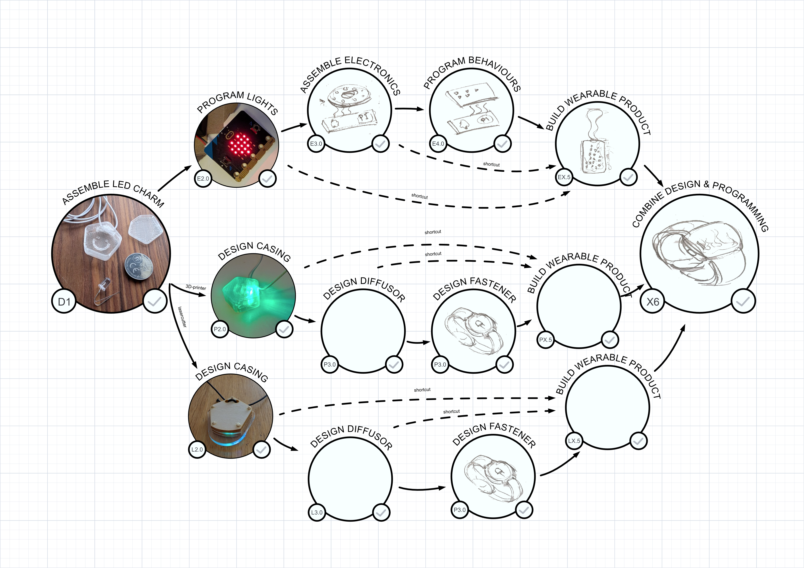

# Design Workshops

##  How to design wearable products and be introduced to the area of Science, Technology, Engineering and Math (STEM + A = STEAM)

I believe that designing a wearable products can be one of the best ways to introduce you people to product design and technology. Therefore theese workshops have been created to play and learn in steps towards mastering product design.

It starts with just assmebling a blinking RGB LED and a CR2032 battery with some tape in a small casing (A1), which enables even small children to build their own blinking necklace in minutes. And then builds from there.

The key aspects of designing a wearable product (light source, energy, control, casing, fastener, diffusor) are here separated into different paths which all are possible to start at a low level of complexity on each aspect.

It's a work in progress so feel free to contribute to the workshops or add variants.

### Workshops Overview

| Category | Explore | Productify | Status |
| -------- | -------- | -------- | -------- |
| Start | [A1 - Assembly your first wearable](A1_Assemble_LED_charm/readme.md) | Not needed |  |
| 3D-print | [P2.0 - Design 3D-printed casing](P2.0_Design_3D-printed_casing/readme.md) | P2.5 - Productify 3D-printed casing |   |
| 3D-print | P3.0 - Design 3D-printed diffusor | P3.5 - Productify diffusor |  WIP |
| 3D-print | [P4.0 - Design 3D-printed fastener](P4.0_Design_3D-printed_fastener/readme.md) | P4.5 - Productify fastener | WIP |
| Lasercut | [L2.0 - Design lasercut casing](L2.0_Design_lasercut_casing/readme.md)   | L2.5 - Productify casing   | draft |
| Lasercut | L3.0 - Design lasercut diffusor | P3.5 - Productify diffusor | - |
| Lasercut | L4.0 - Design lasercut fastener | L4.5 - Productify fastener | - |
| Electronics | [E2.0 - Program LED](E2.0_Program_LED/readme.md) | [E2.5 - Productify LED](E2.5_Productify_LED/readme.md) | draft |
| Electronics | E3.0 - Assemble Electronics | E3.5 - Productify Assembled Electronics | - |
| Electronics | E4.0 - Program Behaviours | E4.5 - Productify Behaviours | - |
| Goal | X6 - Combine Casing and Electronics | X6.5 - Productify | - |

### Workshop outline

There are two ways to start (left side) the journey towards mastering product design of a Wearable. Then combine the knowledge to design full products (right side)

- **D: Casing & fastener design** - Keep the basic blinking LED and focus on the casing design and how to mount it to a person (string, clip, wristband, etc). Choose 3D printed or laser cut path depending on what equipment you intend to use (unless fully digital design workshops).

- **E: Programming & electronics** - Skip the casing & use the simplest fastener (string) so you can focus on how to control the behaviour of the light and the electronics

## Key concepts for the product design process

The role of the designer is to keep asking the right questions and thinking about different aspects about the product. And when entering uncharted terretory you need to take development in steps and iterate step by step. 

This takes training and the ability to mix imagination and hands on test things. 

A good description of the work of a designer was apperantly said by Steve Jobs at Apple:

> Designing a product is keeping 5,000 things in your brain, these concepts, and fitting them all together in kind of continuing to push to fit them together in new and different ways to get what you want. - Steve Jobs

For these werable workshops I hope it should be enough to keep about 7 things in your brain:

- How should the product appear to the user (light, shape, behaviour)?
- How should the user wear the product?
- How should the user take the product on / off
- How should the user turn the product on / off
- How should the light, battery and controller stay together?
- How should the product be manufactured?
- How should the product be assembled?

And for a real product you also need to include
- What is the total cost of the product (material, manufacturing, assembly, handling, shipping, etc)?
- What happens to the product when it breaks down (repair, recycle)? 

### Key concepts of a wearable product that emit light

**Light source:** Something that emits light can really help a wearable thing to be interesting. Start with a blinking LED RGB that just needs 3V to get going.

**Diffusor:** Design the way the light spread and appears to someone wathcing it. Start with a matte transparent plastic.

**Energy source:** Bring along a battery to make a wearable product easy to use. Start with a 3V CR2032 for small form factor and easy use.

**Casing:** Keep the battery, light source and diffusor together in one place. Start with a small hexagonal box with a lid (or similar)

**Fastener:** Make it possible for the user to wear the product on their body. Start with a string to use as a necklace.

**Controls:** Design the behaviour of the light. Start with a predetermined blinking or controling a single diode with a micro processor.

## Contribution guidelines

Test, play, feedback and add your own variants

